## Quick links

- [Challenges of SE](#challenges-of-se)
- [Standard Software Phases](#standard-software-phases-from-notes)
- [Role of Artifacts](#role-of-artifacts-from-notes)
- [Software Process Models](#software-process-models-from-notes)
- [Software Life Stages / Lifespan Model](#software-life-stages--lifespan-model-from-notes)
- [Software Evolution](#software-evolution-from-notes)
- [Code Analysis](#code-analysis-from-notes)

---


### Challenges of SE

- Representations: mathematical, visual (diagrams), code, natural language, verbal
- Multiple formats
- There are many tools:
	- lightweight, independent
	- heavyweight, interdependent

- Collaboration
- Evolution

Exam tips

- Be ready to give a concrete example for each challenge and explain the impact on process/design.
- If given a scenario, identify which challenge(s) are at play and how you’d mitigate them.
Diagram (derived from Introduction notes)

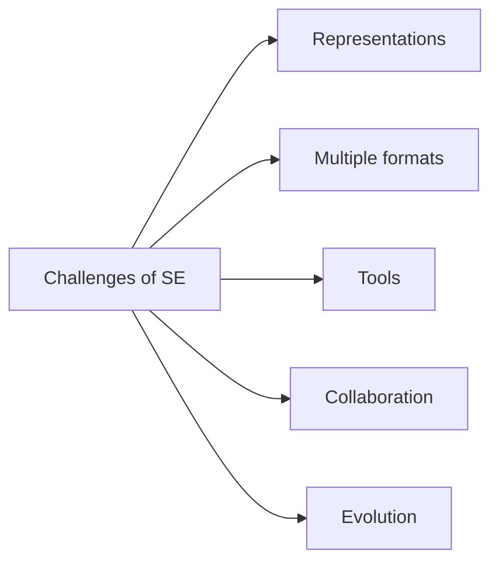

<sub>Focus: be ready to give examples for each challenge area and how it impacts process or design.</sub>

---

### Standard Software Phases (from notes)

- Requirements
- Analysis
- Design
- Implementation
- Testing & Validation
- Release
- Maintenance

Exam tips

- For each phase, be able to name typical inputs/artifacts and outputs/deliverables.
- Given a task, place it in the correct phase and justify briefly.

Diagram

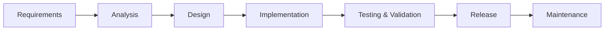

<sub>Know the order and what each phase produces (inputs/outputs).</sub>

Fundamental Activities (from notes)

- Specification
- Design & Implementation
- Validation
- Evolution


<sub>Activities are conceptual workflows, not the same as phase names.</sub>

### Role of Artifacts (from notes)

- Dimensions include: Artifacts, Representations, Participants, Tools
- Artifacts for analysis: Source code; design docs (e.g., UML); issue trackers; requirements; test cases

Exam tips

- Tie each artifact to its purpose and primary consumer (e.g., tests → validation; UML → design/communication).
- Recognize which dimension (artifacts/representations/participants/tools) a given example belongs to.

Diagram (Place of Process from Process notes)

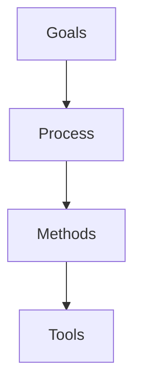

<sub>Place concrete examples under each layer (e.g., UML as a method; IDEs as tools).</sub>

### Software Process Models (from notes)

- Traditional paradigms: Waterfall; Prototype/Spiral; Component-based
- Fundamental activities: Specification; Design & Implementation; Validation; Evolution
- Waterfall notes: phases completed/verified before next; strong QA stages; historically common but limited for changing requirements

Exam tips

- Contrast Waterfall vs Iterative/Agile in terms of handling changing requirements.
- Choose a model for a short scenario and state one trade-off.

Waterfall Model (as referenced in notes)


<sub>Source: Wikipedia (linked in course notes)</sub>

<sub>Emphasis: sequential verification; weak at handling changing requirements.</sub>

### Software Life Stages / Lifespan Model (from notes)

- Staged Software Lifecycle Model (Rajlich & Bennett 2000):
	- Initial Development: deliver first operational version; time-bound (requirements, design, implementation); choose tech, architecture, domain knowledge
	- Evolution: adapt to changing needs; add features; correct mistakes; iterative changes; typically grows; releases often business-driven (alpha/beta)
	- Servicing: no longer evolves; limited to patches/wrappers; different process than evolution; can be outsourced; legacy concerns
	- Phaseout: no further updates; still used; users work around limitations
	- Closedown: retire the system; plan exit; train users; archive/migrate data

Exam tips

- Memorize the stage order and be able to identify transition triggers (e.g., from Evolution → Servicing).
- Explain the key difference between Evolution and Servicing in one sentence.

Staged Lifecycle Diagram (from notes)


<sub>Know each stage’s purpose and triggers for moving to the next stage.</sub>

Versioned Staged Lifecycle (from notes)


<sub>Relate stages to product versions (v1, v2, …, vn).</sub>

Diagram (derived)

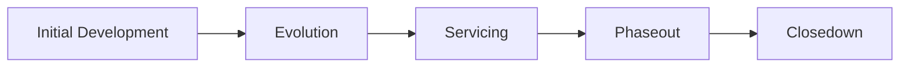

<sub>Memorize the order: Initial Development → Evolution → Servicing → Phaseout → Closedown.</sub>

### Software Evolution (from notes)

- Greenfield: from scratch; rare in practice; aligns with S-type programs
- Brownfield: build on existing systems; majority of real-world work; aligns with E-type programs
- Maintenance dominates lifecycle effort (often ~80%) and is different in SE context
- Maintenance categories (Swanson; ISO/IEC 14764): Corrective; Adaptive; Perfective; Preventive
- Evolution view: Development + Maintenance; iterate complete process for each version; used by open-source and agile methods
- Changing requirements: volatility is common; design for change via modularity, abstraction, encapsulation, decoupling, configuration, extensibility, reuse, version control (trade-offs: complexity, overengineering)

Diagrams (derived)

Greenfield vs Brownfield

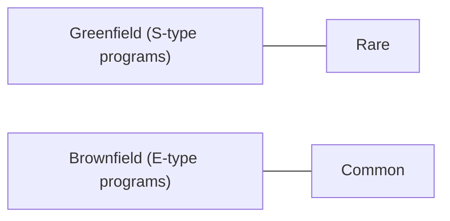

<sub>Greenfield is rare in practice; most work is brownfield on existing systems.</sub>

Maintenance Categories (Swanson; ISO/IEC 14764)

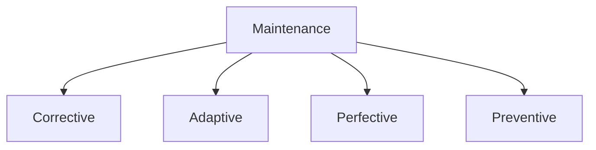

<sub>Be able to define: corrective (bugs), adaptive (environment), perfective (quality/features), preventive (avoid future issues).</sub>

### Lehman's Laws (from notes)

- Types of systems: S-type (formally specified), P-type (iteratively discovered), E-type (must evolve); laws apply primarily to E-type systems
- Law I — Continuing Change: software in use must be continually adapted or it becomes less satisfactory
- Law II — Increasing Complexity: complexity grows with evolution unless actively reduced
- Law III — Self Regulation: evolution processes exhibit regular, self-regulating behavior over time
- Law IV — Conservation of Organisational Stability: average effective activity rate remains invariant over the product lifetime
- Law V — Conservation of Familiarity: successive releases have statistically invariant content to maintain team familiarity
- Law VI — Continuing Growth: functionality must increase to maintain user satisfaction over time
- Law VII — Declining Quality: perceived quality declines unless rigorously maintained and adapted to environment changes

Exam tips

- Be able to match a short scenario to the correct law and explain why in one sentence.
- Know S/P/E types and that the laws focus on E-type systems.

Diagram (derived)

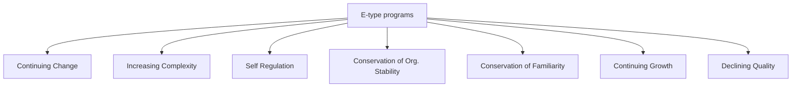

### Code Analysis (from notes)

- Static vs Dynamic analysis
	- Static: analyze code/artifacts without running
	- Dynamic: analyze behavior/outputs during execution
- Granularity levels: tokens; statements; methods; classes; files; groups of files; complete programs
- Regular expressions: lexical/token view; fast; widely available; great for simple parsing/search; limited context understanding
- Abstract Syntax Tree (AST): syntax-aware; suitable for complex parsing; disadvantages include difficulty with fragments/non-compilable code, preprocessor issues, larger size, slower

Static vs Dynamic (derived)

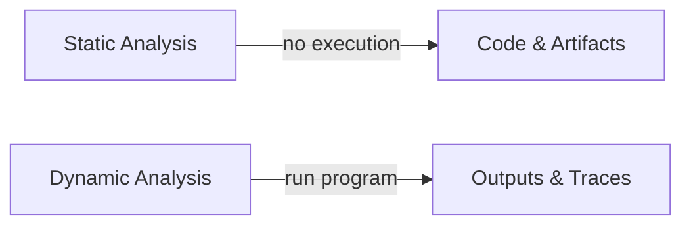

<sub>Static inspects code without running; dynamic runs the system and observes behavior.</sub>

Lexing to Parsing pipeline (derived)

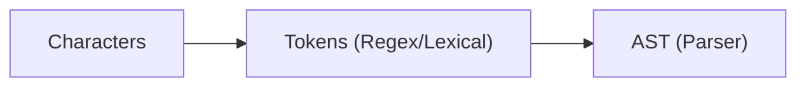

<sub>Regex/lexers produce tokens; parsers build ASTs for syntax-aware analysis.</sub>

AST Illustration (referenced in notes)


<sub>Source: ruslanspivak.com (linked in course notes)</sub>

<sub>ASTs answer syntax-level questions; note limitations cited in the notes.</sub>

### Static Analysis: Graphs (from notes)

- Call Graph — nodes: functions/methods; edges: calls
- Control-Flow Graph (CFG) — nodes: statements; edges: control-flow
- Program Dependency Graph (PDG) — captures data and control dependencies (often basis for slicing)
- Data Flow Diagram (DFD) — data movement view (listed among major graphs)

Diagram (derived)

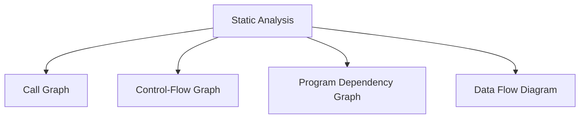

Exam tips

- Given a code snippet, be ready to say what a node/edge represents in each graph type.

Call Graph — example (from notes gist)

```cpp
// Nodes are functions/methods; edges are calls
void f() { g(); h(); }
void g() { h(); i(); }
void h() { i(); }
void i() {}
```

Graph (derived)

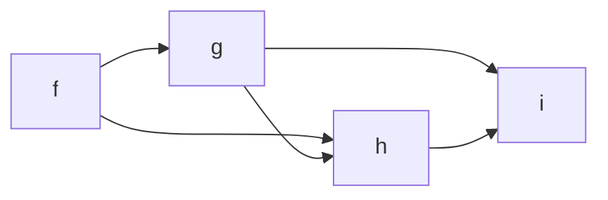

Optional (GraphViz DOT)

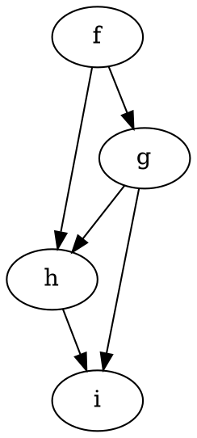

Control-Flow Graph (CFG) — example (from notes gist)

```cpp
// std::vector-based binary search as used in the slides
std::vector<int>::const_iterator search(std::vector<int>::const_iterator begin,
										std::vector<int>::const_iterator end,
										int value) {
	auto currentEnd = end;
	auto currentBegin = begin;
	while (std::distance(currentBegin, currentEnd) > 0) {

		// middle
		const auto middle = std::next(currentBegin, std::distance(currentBegin, currentEnd) / 2);

		if (value < *middle) {
			// value in left half
			currentEnd = middle;
		} else if (value > *middle) {
			// value in right half
			currentBegin = middle + 1;
		} else {
			// value found
			return middle;
		}
	}

	// value not found
	return end;
}
```

CFG image from notes


Mini-CFG (derived for the if/else)

```mermaid
flowchart TD

S[Start while] --> C{a[mid] == x?}
C -- yes --> R1[return mid]
C -- no --> C2{a[mid] < x?}
C2 -- yes --> L[lo = mid + 1]
C2 -- no --> H[hi = mid - 1]
L --> S
H --> S
```

Program Dependency Graph (PDG) — concept and slice tie-in

- PDG encodes control and data dependencies between statements; it’s often the basis for slicing
- From the slicing notes, a backward static slice for criterion <line, variable> contains statements that affect that variable at that point

Example tie-in (from slicing notes; simplified)

```cpp
int n = read();     // defines n
int i = 1;          // defines i
int sum = 0;        // defines sum
while (i <= n) {
	sum = sum + i;    // sum depends on prior sum and i
	i = i + 1;        // i depends on prior i
}
println(sum);       // slicing criterion could be <line, sum>
```

PDG (derived, partial)

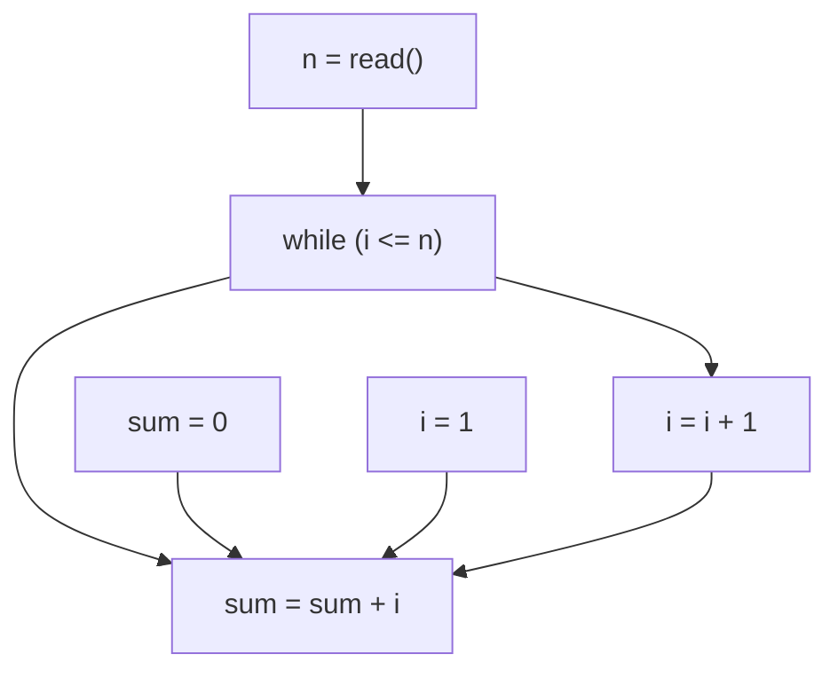

### Coupling & Cohesion (from notes)

- Cohesion — degree of connectivity within one module/class; aim to maximize internal interaction
- Common cohesion types (best→worst in context): Informational, Functional, Sequential, Communicational, Procedural, Temporal, Logical, Coincidental
- Why high cohesion? easier to comprehend, test, reuse
- Coupling — degree of interdependence between modules; prefer low coupling

Exam tips

- Identify the cohesion type from a short class/method description and state if it’s desirable.
- Explain why high cohesion and low coupling are good in one sentence each.

### Program Slicing and srcSlice (from notes)

- Program slice: parts of a program that potentially affect values at a point of interest (slicing criterion, often <line, variable>)
- Slice types: backward static; forward static; dynamic; execution; inter/intra-procedural
- Slices are often computed from PDG; srcSlice is an efficient forward static slicing approach computed directly from source (not PDG)
- srcSlice: builds a system dictionary per variable (file, function, variable, slines, cfunctions, dvariables, pointers, controledges); built on srcML; supports C/C++ (noted), also Java/C# in concept
- Performance examples (from notes): Linux ~13M LOC in minutes; Blender/InkScape in seconds to minutes

How to apply (from notes)

1) Choose slicing criterion (e.g., <line, variable>)
2) Use srcSlice to compute the system dictionary entries
3) Build the slice from slines plus related entries (dvariables, cfunctions, pointers), excluding lines before the variable’s definition

Diagram (derived)

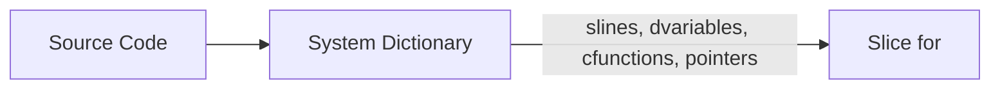

Exam tips

- Be able to define a slice and name the common types; outline how srcSlice differs from PDG-based slicing.